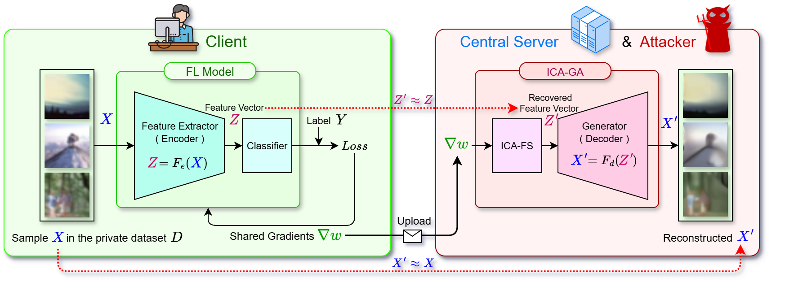

# ICA-driven Generative Attacks (ICA-GA)



这是论文 "**Unmixing Gradients: Uncovering Persistent Leakage in Federated Learning via Independent Component Analysis**" 的代码实现。

在这项工作中，我们提出了ICA-GA，一个由独立成分分析（ICA）算法驱动、基于生成式攻击范式的梯度泄漏攻击框架。通过将特征分离任务重塑为信号处理领域经典的盲源分离问题，该方法克服了现有方法的局限性，在联邦学习的全生命周期内展现出更鲁棒的持续威胁。

论文链接： https://doi.org/10.1016/j.sysarc.2025.103681

## 1. 准备工作

### 1.1 获取源码

```sh
# 克隆本仓库
git clone https://github.com/anonymous/ICA-GA.git
cd ICA-GA
```

### 1.2. 创建Conda环境

```sh
conda create --name ica-ga python=3.12 -y
conda activate ica-ga
pip install -r requirements.txt
```

### 1.3. 下载预训练模型

为了快速复现论文中的核心实验，强烈建议下载我们预训练好的模型文件。

- `ResNet50_no-avgpool_out-100_cifar100_fine-tuned.pth`: ResNet-50模型。基于PyTorch默认预训练参数，在Cifar100上充分微调。作为FL模型。
- `gen_1x_CT_RCSE_r50_fine_tuned.pth`: 与上述FL模型匹配的、训练好的轻量级生成器。

```sh
# 创建数据目录
mkdir -p data/fl_models
mkdir -p data/gen_models
mkdir -p data/temp
# 下载模型压缩包
wget -O data/temp/models_fine-tuned.zip https://github.com/anonymous/ICA-GA/releases/download/models/models_fine-tuned.zip
# 解压
unzip -q data/temp/models_fine-tuned.zip -d data/temp
# 移动模型
mv data/temp/fl_models/ResNet50_no-avgpool_out-100_cifar100_fine-tuned.pth data/fl_models/ResNet50_no-avgpool_out-100_cifar100_fine-tuned.pth
mv data/temp/gen_models/gen_1x-CT-RCSE_r50-fine-tuned.pth data/gen_models/gen_1x-CT-RCSE_r50-fine-tuned.pth
# rm -r data/temp # 清理临时文件
```

### 1.4. 准备数据集

- **攻击测试数据集 (CIFAR-100等)**: 首次运行实验时，代码将自动下载到 `./data/datasets` 目录下。
- **生成器训练辅助数据集 (ImageNet)**: 需要手动下载，详见第3节。

## 2. 攻击实验

可以通过修改命令行参数来运行不同实验。

- **参数格式**: `-key=value`。请注意必须以`-`开头，使用 `=` 连接，且不含多余空格。
- **更多参数**: 每个实验脚本（如 `fedsgd_attacks.py`）的注释中都包含了更详细的参数说明。

实验结果会保存到指定的csv表格文件。如果是重复多次的实验，那么表格中一般用`test_num`列标注实验序号，最后用`all`行记录所有指标的均值。

### 2.1. FedSGD 攻击测试

```sh
python3 exps/fedsgd_attacks/fedsgd_attacks.py \
    -result_dir=results\
    -result_name=result.csv\
    -fl_model_load.load_dir=./data/fl_models\
    -fl_model_load.load_name=ResNet50_no-avgpool_out-100_cifar100_fine-tuned\
    -fl_model_load.load_fc=False\
    -fl_model_kwargs.output_length=1000\
    -fl_model_kwargs.is_avgpool=False\
    -attacks.ICA-GA.model_save_dir=./data/gen_models\
    -attacks.ICA-GA.model_save_name=gen_1x-CT-RCSE_r50-fine-tuned\
    -data_iter_kwargs.dataset_name=cifar100\
    -data_iter_kwargs.batch_size=32\
    -device=cuda:0\
    -seed=42\
    -data_iter_kwargs.dataloader_seed=42\
    -test_batchs=10\
    -rep_rate=0.0
```

提示：设置 `-rep_rate=1.0` 可构造100%标签重复的实验环境。

| 基本参数 | 说明 |
|--|--|
|result_dir=results | 实验结果存放目录（相对于fedsgd_attacks.py） |
|result_name=result.csv | 实验结果输出文件名，csv文件 |
|fl_model_load.load_dir=./data/fl_models | FL模型加载目录（相对于工作目录，即实验根目录） |
|fl_model_load.load_name=ResNet50_no-avgpool_out-100_cifar100_fine-tuned | FL模型文件名（无需.pth后缀） |
|fl_model_load.load_fc=False | FL模型不加载分类器（使用初始化参数） |
|fl_model_kwargs.output_length=1000 | 指定FL模型分类数 |
|fl_model_kwargs.is_avgpool=False | 移除FL模型的平均池化层（必须） |
|attacks.ICA-GA.model_save_dir=./data/gen_models | 生成器模型加载目录 |
|attacks.ICA-GA.model_save_name=gen_1x-CT-RCSE_r50-fine-tuned | 生成器模型文件名（无需.pth后缀） |
|data_iter_kwargs.dataset_name=cifar100 | 测试数据集，可选 caltech256, cifar10, cifar100, mnist, imagenet |
|data_iter_kwargs.batch_size=32 | 测试批大小 |
|device=cuda:0 | 实验设备 |
|seed=42 | 主随机种子 |
|data_iter_kwargs.dataloader_seed=42 | 加载测试数据的随机种子 |
|test_batchs=10 | 实验重复次数 |
|rep_rate=0.0 | [可选]标签重复率：若设为0.0<rep_rate<=1.0，则构造特殊的数据批次，使得其中占比rep_rate的样本为相同标签 |

### 2.2. FedAVG 攻击测试

```sh
python3 exps/fedavg_attacks/fedavg_attacks.py \
    -result_dir=results\
    -result_name=result.csv\
    -fl_model_load.load_dir=./data/fl_models\
    -fl_model_load.load_name=ResNet50_no-avgpool_out-100_cifar100_fine-tuned\
    -fl_model_load.load_fc=False\
    -fl_model_kwargs.is_avgpool=False\
    -fl_model_kwargs.output_length=1000\
    -attacks.ICA-GA.model_save_dir=./data/gen_models\
    -attacks.ICA-GA.model_save_name=gen_1x-CT-RCSE_r50-fine-tuned\
    -data_iter_kwargs.dataset_name=cifar100\
    -data_iter_kwargs.batch_size=8\
    -data_iter_kwargs.local_steps=4\
    -data_iter_kwargs.local_epochs=1\
    -seed=42\
    -data_iter_kwargs.dataloader_seed=42\
    -test_batchs=10\
    -device=cuda:0
```

| 基本参数 | 说明 |
|--|--|
|result_dir=results | 实验结果存放目录（相对于fedavg_attacks.py） |
|result_name=result.csv | 实验结果输出文件名，csv文件 |
|fl_model_load.load_dir=./data/fl_models | FL模型加载目录（相对于工作目录，即实验根目录） |
|fl_model_load.load_name=ResNet50_no-avgpool_out-100_cifar100_fine-tuned | FL模型文件名（无需.pth后缀） |
|fl_model_load.load_fc=False | FL模型不加载分类器（使用初始化参数） |
|fl_model_kwargs.output_length=1000 | 指定FL模型分类数 |
|fl_model_kwargs.is_avgpool=False | 移除FL模型的平均池化层（必须） |
|attacks.ICA-GA.model_save_dir=./data/gen_models | 生成器模型加载目录 |
|attacks.ICA-GA.model_save_name=gen_1x-CT-RCSE_r50-fine-tuned | 生成器模型文件名（无需.pth后缀） |
|data_iter_kwargs.dataset_name=cifar100 | 测试数据集，可选 caltech256, cifar10, cifar100, mnist, imagenet |
|data_iter_kwargs.batch_size=8 | 测试批大小 |
|data_iter_kwargs.local_steps=4 | 本地训练步数 |
|data_iter_kwargs.local_epochs=1 | 本地训练轮次 |
|seed=42 | 主随机种子 |
|data_iter_kwargs.dataloader_seed=42 | 加载测试数据的随机种子 |
|test_batchs=10 | 实验重复次数 |
|device=cuda:0 | 实验设备 |

## 3. 生成器训练

可针对不同的FL模型，训练或微调生成器。

### 3.1. 准备ImageNet数据集

生成器训练需要`ImageNet (ILSVRC2012)`作为辅助数据集。请访问 [image-net.org](https://image-net.org/challenges/LSVRC/2012/2012-downloads.php) 手动下载以下文件，并解压至 `./data/datasets/imagenet`。

  - `ILSVRC2012_devkit_t12.tar.gz`
  - `ILSVRC2012_img_train.tar`
  - `ILSVRC2012_img_val.tar`

最终的目录结构应如下所示：

```
./data
└ datasets
    └ imagenet
        ├ ILSVRC2012_devkit_t12
        ├ train
        │  ├ n01440764
        │  └ ……
        └ val
            ├ n01440764
            └ ……
```

### 3.2. 执行训练

#### 从头训练生成器：

```sh
python3 exps/train_generator/train_generator.py \
    -result_dir=results\
    -fl_model_load.load_dir=./data/fl_models\
    -fl_model_load.load_name=ResNet50_no-avgpool_out-100_cifar100_fine-tuned\
    -generator_model_kwargs.save_dir=./data/gen_models\
    -generator_save_name=gen_1x-CT-RCSE_r50_epochs=end\
    -trainer_kwargs.train_dataset=imagenet\
    -trainer_kwargs.test_dataset=cifar100\
    -trainer_kwargs.batch_size=32\
    -trainer_kwargs.num_epochs=100\
    -trainer_kwargs.max_batchs=1000\
    -trainer_kwargs.lr=0.0001\
    -trainer_kwargs.loss.mse=1.0\
    -trainer_kwargs.loss.feat=0.01\
    -trainer_kwargs.loss.tv=0.01\
    -trainer_kwargs.loss.ssim=0.01\
    -trainer_kwargs.save_eval=psnr\
    -trainer_kwargs.save_eval_up=true\
    -trainer_kwargs.stop_eval_value=23\
    -trainer_kwargs.early_stop_patience=20
```

#### 增量微调：

如果需要对一个已有的生成器进行微调（例如，在FL模型更新后），请添加 `-generator_load_name` 参数。建议设置更小的学习率`trainer_kwargs.lr`、更细的评估粒度`trainer_kwargs.max_batchs`。这对应我们论文中提出的高效持续性攻击策略。

示例：（假设`fl_epochs`表示FL训练轮次。您需要预先准备对应的FL模型训练历史文件）

```sh
for fl_epochs in {1..50}; do
    python3 exps/train_generator/train_generator.py \
        -result_dir=results\
        -fl_model_load.load_dir=./data/fl_models\
        -fl_model_load.load_name=ResNet50_epochs=${fl_epochs}\
        -generator_model_kwargs.save_dir=./data/gen_models\
        -generator_load_name=gen_1x-CT-RCSE_r50_epochs=${fl_epochs-1}\
        -generator_save_name=gen_1x-CT-RCSE_r50_epochs=${fl_epochs}\
        -trainer_kwargs.train_dataset=imagenet\
        -trainer_kwargs.test_dataset=cifar100\
        -trainer_kwargs.batch_size=32\
        -trainer_kwargs.num_epochs=100\
        -trainer_kwargs.max_batchs=100\
        -trainer_kwargs.lr=0.00001\
        -trainer_kwargs.loss.mse=1.0\
        -trainer_kwargs.loss.feat=0.01\
        -trainer_kwargs.loss.tv=0.01\
        -trainer_kwargs.loss.ssim=0.01\
        -trainer_kwargs.save_eval=psnr\
        -trainer_kwargs.save_eval_up=true\
        -trainer_kwargs.stop_eval_value=23; \
done
```

| 基本参数 | 说明 |
|--|--|
| result_dir=results | 训练记录保存目录（相对于train_generator.py）|
| recorder_save_name=result.csv | [可选]训练记录文件名。默认为 {generator_save_name}.csv|
| fl_model_load.load_dir=./data/fl_models | FL模型加载目录|
| fl_model_load.load_name=ResNet50_no-avgpool_out-100_cifar100_fine-tuned | FL模型文件名（无需.pth后缀） |
| generator_model_kwargs.save_dir=./data/gen_models | 生成器模型目录|
| generator_load_name=gen_1x-CT-RCSE_r50-fine-tuned | [可选]加载已有的生成器文件进行增量微调|
| generator_save_name=gen_1x-CT-RCSE_r50_1 | 生成器保存文件名（无需.pth后缀） |
| trainer_kwargs.train_dataset=imagenet | 生成器训练集|
| trainer_kwargs.test_dataset=cifar100 | 生成器评估集|
| trainer_kwargs.batch_size=32 | 训练批大小。24g显存时最大可设为48|
| trainer_kwargs.num_epochs=100 | 训练轮次上限|
| trainer_kwargs.max_batchs=1000 | [可选]单轮训练中使用的批次上限。降低该值可以减小训练粒度，更频繁的进行评估|
| trainer_kwargs.lr=0.0001 | 学习率。从头训练时`0.0001`，增量微调时`0.00001` |
| trainer_kwargs.loss.mse=1.0 | 损失权重|
| trainer_kwargs.loss.feat=0.01 ||
| trainer_kwargs.loss.tv=0.01 ||
| trainer_kwargs.loss.ssim=0.01 ||
| trainer_kwargs.save_eval=psnr | 主评估指标。当前轮次的评估值好于历史最佳值时，保存模型文件|
| trainer_kwargs.save_eval_up=true | 评估指标越大越好|
| trainer_kwargs.stop_eval_value=23 | [可选]早停评估值，指标达到该值时停止训练|
| trainer_kwargs.early_stop_patience=10 | [可选]早停耐心值，连续该轮次无提升时终止训练|

## 4. 引用我们的工作

如果您在您的研究中使用了我们的代码或方法，请考虑引用我们的论文：

```bibtex
@article{li2025unmixing,
  title = {Unmixing gradients: Uncovering persistent leakage in Federated Learning via Independent Component Analysis},
  author={Li, Minhao and Wang, Le and Li, Zhaohua and Hu, Rongxin and Zhou, Tang and Fang, Binxing},
  journal = {Journal of Systems Architecture},
  pages = {103681},
  year = {2025},
  issn = {1383-7621},
  doi = {https://doi.org/10.1016/j.sysarc.2025.103681},
  url = {https://www.sciencedirect.com/science/article/pii/S1383762125003534}
}
```

## 5. 致谢

我们的工作建立在许多优秀的前人研究之上。我们特别感谢以下论文及开源项目为我们提供的参考和便利：

> Fast Generation-Based Gradient Leakage Attacks: An Approach to Generate Training Data Directly From the Gradient
- https://ieeexplore.ieee.org/abstract/document/10505158
- https://github.com/pigeon-dove/FGLA

> Cocktail Party Attack: Breaking Aggregation-Based Privacy in Federated Learning using Independent Component Analysis
- https://proceedings.mlr.press/v202/kariyappa23a.html
- https://github.com/facebookresearch/cocktail_party_attack

## 6. 许可证

本项目采用 [MIT License](https://github.com/anonymous/ICA-GA/blob/main/LICENSE) 授权。
